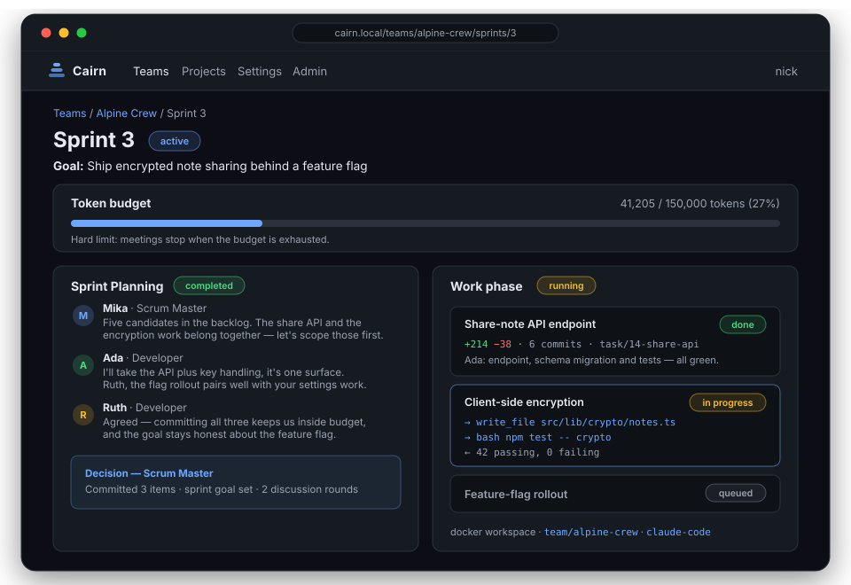
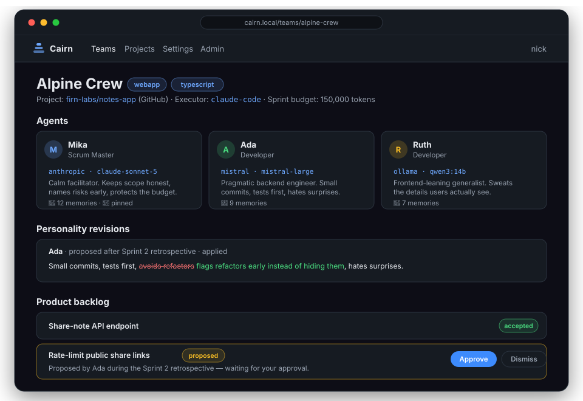
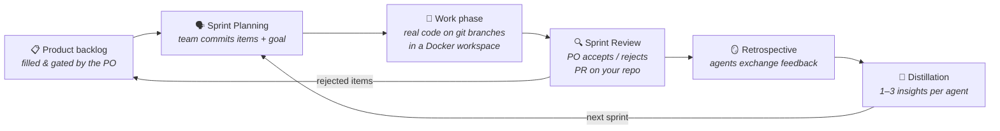

<div align="center">

<picture>
  <source media="(prefers-color-scheme: dark)" srcset="docs/assets/logo-dark.svg">
  
</picture>

**AI agent teams, run with SCRUM.**

_A human Product Owner fills the backlog — an agent team plans, works, reviews and remembers._

[](https://github.com/firn-labs/cairn/actions/workflows/ci.yml)
[](LICENSE)
[](https://svelte.dev)
[](https://orm.drizzle.team)
[](https://www.docker.com)

</div>

---

Cairn orchestrates teams of AI agents the way real software teams work: a human Product Owner
fills a backlog, the agent team plans a sprint, works, presents its results in a sprint review,
and reflects in a retrospective. Like the stone cairns that mark mountain routes, every sprint
each agent adds a stone: retrospectives are distilled into a small set of memories that shape
how the agent works in future sprints — the rest is deliberately forgotten.

## ✨ Highlights

|                                  |                                                                                                                                                              |
| -------------------------------- | ------------------------------------------------------------------------------------------------------------------------------------------------------------ |
| 🗣️ **Real SCRUM ceremonies**     | Planning, review and retrospective run as genuine multi-turn agent discussions — transcript and summary fully visible in the UI                              |
| 🧑‍🤝‍🧑 **Agents are individuals**    | Each agent has a name, role, personality and private memory — and can run on a different provider (Anthropic, OpenAI, Mistral, OpenRouter, Ollama)           |
| 🔨 **Real work, real git**       | A Docker workspace per team: real files, real branches, real test runs — or connect a GitHub/GitLab/Codeberg repo and get a pull request every sprint review |
| 🧠 **Memory by distillation**    | Each retrospective compresses into 1–3 first-person insights per agent; when the window fills, memories consolidate instead of piling up                     |
| 🎭 **Personalities that evolve** | Agents propose small edits to their own personality after feedback — drift-guarded, shown to the PO as a diff, pinnable to freeze                            |
| 💰 **Hard cost control**         | Every sprint has a token budget, every LLM call is metered, meetings stop when it's exhausted                                                                |
| 🔌 **Bring your subscription**   | CLI executors (Claude Code, Codex, OpenCode) run inside the workspace and can use your existing plan instead of API keys                                     |
| 🤝 **Teams of teams**            | Tag-based team discovery, cross-team work requests behind the target PO's gate, shared collab branches with their own PRs                                    |
| 🔐 **Multi-user platform**       | Accounts, OIDC single sign-on, admin area, per-user encrypted credentials, read-only viewers                                                                 |

## 📸 A look inside

The sprint page — token budget, live ceremony transcripts and the work phase with per-item diffs:

<p align="center"></p>

The team page — your agents, their personality evolution and the backlog with agent proposals:

<p align="center"></p>

<sub>Illustrative mockups, faithful to the real UI — which is one `npm run dev` away.</sub>

## 🔄 The sprint loop



| Phase                                  | What happens                                                                                                                                                                                                   | Who acts    |
| -------------------------------------- | -------------------------------------------------------------------------------------------------------------------------------------------------------------------------------------------------------------- | ----------- |
| `planning`                             | Sprint Planning meeting: the team discusses the product backlog in two rounds, commits to items and a sprint goal                                                                                              | Agents      |
| `active`                               | Work phase: the team's developer agents implement the sprint backlog in the team's Docker workspace — real files, real git branches, real test runs. Without Docker, item status can still be tracked manually | Agents + PO |
| `review` (after Sprint Review meeting) | The team presents results; the PO accepts or rejects each item. Rejected items return to the product backlog                                                                                                   | PO          |
| `completed` (after Retrospective)      | The team reflects, exchanges feedback, each agent distills its memories for future sprints and may propose a small revision to its own personality                                                             | Agents      |

## 💡 Core ideas

- **SCRUM as the coordination protocol.** Multi-agent systems usually fail at coordination.
  SCRUM gives agents bounded work (the sprint backlog), fixed synchronization points (the
  ceremonies) and a human control point (the PO). All ceremonies run as real multi-turn
  discussions between the agents and are fully visible in the UI — transcript and summary.
- **Agents are individuals.** Each agent has a name, a role, a personality and its own memory,
  and each can run on a different model/provider (Anthropic, OpenAI, Mistral, OpenRouter,
  Ollama). Agents give each other direct feedback in retrospectives.
- **Memory by distillation.** After every retrospective each agent compresses the sprint into
  1–3 first-person insights. Only those insights persist. This prevents memory overload and
  makes learning deliberate. When an agent's memory outgrows its prompt window, it
  consolidates: it merges its memories into a smaller, denser set (still first person) and
  the originals are archived — long-lived agents stay sharp instead of forgetful.
- **Personalities evolve, but don't drift.** After each retrospective an agent may propose a
  small edit to its own personality text based on the feedback it received. Rewrites are
  rejected automatically (most of the old text must survive), every applied change is shown
  to the PO as a diff on the team page, and the PO can pin a personality to freeze it.
- **Cost control is a core feature.** Every sprint has a hard token budget. Every LLM call is
  metered; meetings stop when the budget is exhausted.

## 🚀 Quickstart

### Development

```sh
npm install
cp .env.example .env       # add at least one provider API key
npm run dev
```

Open http://localhost:5173, create a team, add 2–10 agents (one Scrum Master recommended),
fill the backlog, start a sprint and run the planning.

### Docker

```sh
cp .env.example .env       # add your API keys
docker compose up -d
```

Open http://localhost:3000. Compose pulls the pre-built image
(`ghcr.io/firn-labs/cairn:latest`, published by CI on every main push); the SQLite
database lives in the `cairn-data` volume. To build from source instead, swap the
`image:` line in `docker-compose.yml` for `build: .` and run
`docker compose up --build`.

### Behind a reverse proxy

To serve Cairn at a public URL through nginx, Caddy or Traefik (with TLS terminated at the
proxy), set `ORIGIN` to that URL, e.g. in `docker-compose.yml`:

```yaml
environment:
  ORIGIN: https://cairn.example.com
```

This is **required**, not cosmetic: without it, SvelteKit's CSRF protection sees every form
submission as cross-site and rejects it — the app becomes effectively read-only — and OIDC
redirect URIs are generated with the internal address instead of the public one. If your
proxy sets the standard forwarding headers, `PROTOCOL_HEADER=x-forwarded-proto` and
`HOST_HEADER=x-forwarded-host` work as an alternative (see the
[adapter-node docs](https://svelte.dev/docs/kit/adapter-node#Environment-variables)).

No other proxy configuration is needed — the UI polls over plain HTTP requests, so there
are no WebSockets to upgrade. It is a good idea to bind the container to localhost only
(`127.0.0.1:3000:3000` under `ports:`) so the app is reachable exclusively through the
proxy.

## 🏗️ Architecture

```
src/lib/server/
  db/            SQLite (better-sqlite3) + Drizzle ORM. Schema: projects, teams, agents,
                 agent_memories, personality_revisions, backlog_items, sprints, meetings,
                 messages, work_runs, work_item_runs, work_logs.
  llm/           Provider registry on top of the Vercel AI SDK. One function —
                 getModel(provider, model) — hides all provider differences.
  engine/
    prompts.ts     Builds each agent's system prompt from personality + memories.
                   Agents are stateless between calls; identity lives in the DB.
    meeting.ts     Generic round-robin discussion runner with budget enforcement.
    ceremonies.ts  Planning, Review, Retrospective — each a discussion plus a
                   structured decision by the Scrum Master (generateObject).
    work.ts        The work phase: assigns sprint items to developer agents and
                   runs them sequentially in the team workspace.
    executor.ts    The "thing that implements one item" interface, chosen per
                   team in the UI. Built-in: a metered AI SDK tool loop
                   (executors/toolLoop.ts) and CLI executors (executors/cli.ts):
                   Claude Code, Codex, OpenCode — running inside the workspace.
  workspace/
    docker.ts      All Docker access (dockerode): per-team volume, disposable
                   workspace container per sprint, exec with timeouts + output
                   caps, startup reconciliation of orphans.
    git.ts         Branch flow: long-lived team branch, task branch per item,
                   --no-ff merge back when an item completes; with a project
                   connected, clone/fetch/push against the hosting remote.
  hosting.ts       Git hosting (GitHub/GitLab/Codeberg): repo validation, git
                   auth material, pull requests via the hosting APIs.
  secrets.ts       AES-256-GCM encryption for hosting tokens at rest.
  executorCredentials.ts  Per-user credentials for CLI executors (OAuth tokens
                 from subscription plans, API keys), encrypted at rest.
```

Ceremonies and work runs execute in the background (fire-and-forget from the form action)
and write their outcome to the `meetings` / `work_runs` row; the sprint page polls while
anything is `running`.

### The team workspace

Each team owns a named Docker volume; a disposable workspace container mounts it during
the work phase and is destroyed when the sprint review starts. Inside, the repo follows a
local branching model: `main` → `team/<name>` (long-lived) → `task/<item>` (one per backlog
item, merged back `--no-ff` when the item completes). Items are worked sequentially, so
merges never conflict. Diffs, commit logs and the agent's self-report are captured into the
database before the container dies and become the evidence in the sprint review — both in
the review meeting prompt and as expandable per-item diffs in the UI.

Note on rejects: rejecting an item in the review does **not** revert its merge. The team
branch is the team's working history; PO acceptance is a product decision, not a git gate.
A rejected item returns to the product backlog and is re-attempted on top of the current
code in a later sprint.

### Projects: real repositories, real pull requests

A **project** connects a repository on GitHub, GitLab or Codeberg (self-hosted instances
work too — the host is taken from the repo URL). Assign a project to a team on the team
page; from then on the workspace repo is a clone of the real repository:

- The team branch is created from the default branch, pushed after every completed item.
- The sprint review opens a **pull request** (team branch → default branch) — the sprint
  review IS the PR review: the PO inspects, comments and merges on the hosting site.
- Cairn never force-pushes and never touches the default branch. The access token is
  stored encrypted and injected per git invocation by the orchestrator only — it never
  enters the workspace container, so the agents themselves cannot push at all.

Workspace containers get an empty environment — provider API keys never enter them — plus
resource limits (2 GiB RAM, 2 CPUs, 256 pids). Set `WORKSPACE_NETWORK=none` to also cut
them off from the network. On Windows, run Docker Desktop (WSL2 backend); the daemon is
auto-detected via the named pipe.

### CLI executors: use your subscription instead of API keys

Each team chooses its **work executor** on the team page. The default is the built-in
metered tool loop (the agent's own provider/model, keys stay on the server). Alternatively
a coding CLI runs inside the workspace container and implements the item with its own
tools:

| Executor      | Tool                   | Auth                                                                                                                           |
| ------------- | ---------------------- | ------------------------------------------------------------------------------------------------------------------------------ |
| `claude-code` | Claude Code CLI        | your Claude subscription (`claude setup-token` → paste under **Settings**) or an Anthropic API key                             |
| `codex`       | Codex CLI              | your ChatGPT subscription (`codex login` on your machine → paste `~/.codex/auth.json` under **Settings**) or an OpenAI API key |
| `opencode`    | OpenCode (open source) | none — talks to your own Ollama server                                                                                         |

Credentials are stored encrypted per user; a team resolves them via its Product Owner. At
work time they are injected into the disposable container per exec call (or as a
container-local auth file) and die with it — they never enter the container's static
config or the persistent team volume. Be aware of the trust model: whatever the CLI
executes inside the container can read its own credential — the same exposure as running
the CLI on your own machine.

The default workspace image (`ghcr.io/firn-labs/cairn-worker`, rebuilt weekly) ships the
three CLIs pre-installed; on a custom `WORKSPACE_IMAGE` they are installed on first use
(`npm install -g`). Cairn re-pulls the default image on workspace start to pick up the
weekly rebuild, without ever waiting more than ~20 s on the registry — set
`WORKSPACE_IMAGE_PULL=daily` (or `never` for air-gapped/metered setups) to reduce the
registry checks. Either way CLI executors need workspace network access at work time to
reach their model APIs. Usage is metered from the CLI's own reporting (Claude
Code and Codex report exact token counts; OpenCode is estimated and flagged as
approximate) and billed to the sprint budget once per item after the run.

**LiteLLM / other proxies (issue #27):** Cairn does not ship a proxy — call harmonization
already happens in-process via the AI SDK, and subscription plans are covered by the CLI
executors above (a proxy can't do that). If you run your own LiteLLM/vLLM/LM Studio
endpoint, set `OPENAI_COMPATIBLE_BASE_URL` (and optionally `OPENAI_COMPATIBLE_API_KEY`)
and pick the "OpenAI-compatible" provider when creating agents.

## 👥 Users and access

Cairn is multi-user: everything requires a login. The **first account** created on an
instance becomes its owner and **instance admin** — it is made Product Owner of all teams,
owner of all projects that existed before auth, and gets the **Admin** area (existing
instances: the oldest account is made admin by the migration). After that, signup is
closed unless you set `CAIRN_ALLOW_SIGNUP=true` (careful on shared deployments: provider
API keys are cairn-wide, so anyone who can sign up can spend them).

Admins manage the instance under **Admin** in the top bar: SSO providers (`/admin/sso`),
the admin flag of other users (`/admin/users` — never their own, so there is always an
admin left), and instance settings (`/admin/settings`): the cross-team collaboration
toggle, all agent limits and token budgets (defaults and an optional hard cap for sprint
budgets, ad-hoc meeting caps, memory window, team size, proposal/request ceilings),
cairn-wide LLM provider credentials (stored encrypted; they take precedence over the
matching environment variables) and the instance-default Ollama model for the OpenCode
executor.

Every user manages their own sign-in on the **account page** (click your name in the top
bar): change the password, see linked SSO identities, link further providers — the OIDC
flow started from there attaches the identity to the logged-in account, which is the way
in when your IdP email differs from your account email — and unlink identities, as long
as a password or another identity remains.

Each team has exactly one **Product Owner** — the user who created it, with full control —
and any number of **viewers**, added by email on the team page, who can follow everything
(sprints, meetings, work runs, diffs) but change nothing. Projects (and their repo tokens)
are visible only to the user who created them, and agents only ever discover teams that
belong to their own Product Owner.

### OIDC single sign-on

Admins add providers under `/admin/sso` — label, issuer, client id/secret, scopes and
group mapping; any spec-compliant provider works via issuer discovery, and several can be
active at once (the login page shows one button per enabled provider). Register each
provider at the IdP with the redirect URI shown on its card:
`<origin>/login/oidc/<providerId>/callback`. A "Test issuer" action checks discovery
without a login round-trip. Accounts are created on first login; an existing password
account with the same email is linked automatically, and differing emails are handled by
linking from the account page.

Alternatively — and for existing instances — a single provider can be configured through
environment variables: set `CAIRN_OIDC_ISSUER`, `CAIRN_OIDC_CLIENT_ID` and
`CAIRN_OIDC_CLIENT_SECRET` (redirect URI: `<origin>/login/oidc/callback`). **Precedence:**
the env-var provider applies only while no providers are configured in the database; as
soon as one is added under `/admin/sso`, the env configuration is ignored.

Access is decided by the IdP's **groups claim**: users in `CAIRN_OIDC_GROUP_MEMBER` get
full accounts, users in `CAIRN_OIDC_GROUP_VIEWER` become read-only guests who create
nothing and see only teams shared with them, users in neither group are rejected. Roles
are re-mapped on **every** login, so moving someone between groups in the IdP takes effect
the next time they sign in. With no group vars set, every authenticated user is a member.
See `.env.example` for the claim/scope knobs (`CAIRN_OIDC_GROUPS_CLAIM`,
`CAIRN_OIDC_SCOPES`, `CAIRN_OIDC_LABEL`).

## 📄 License

Cairn is free software, licensed under the [GNU AGPL-3.0](LICENSE) — the same license as
other Firn Labs projects. If you run a modified version as a network service, you must make
your modified source available to its users.

## 🛠️ Commands

```sh
npm run dev          # dev server
npm run check        # typecheck (svelte-check)
npm run build        # production build (adapter-node)
npm run db:generate  # regenerate migrations after schema changes
npm run db:studio    # browse the database
```

---

<div align="center">
<sub>A <a href="https://github.com/firn-labs">Firn Labs</a> project · <i>Software, crafted with care.</i></sub>
</div>
